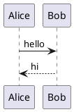
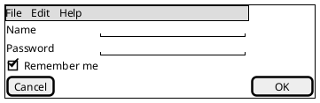

# PlantUML for GitHub

Renders ` ```plantuml ` code blocks directly on GitHub pages, using the
TeaVM-compiled PlantUML engine that runs entirely client-side.
Available for **Chrome** and **Firefox**.

**No server. No tokens. No tracking. Zero permissions.**

---

## Contents

- [Install](#install)
- [Supported diagrams](#supported-diagrams)
- [Live demo](#live-demo)
- [How it works](#how-it-works)
- [Security & permissions](#security--permissions)
- [Build from source](#build-from-source)
- [Roadmap](#roadmap)
- [Why this extension exists](#why-this-extension-exists)
- [License](#license)

---

## Install

| Browser | Link |
| --- | --- |
| Chrome | [Chrome Web Store](https://chromewebstore.google.com/detail/plantuml-for-github/lbokhidfopkdehkmlmpaabacljoediic) |
| Firefox | [Firefox Add-ons](https://addons.mozilla.org/en-US/firefox/addon/plantuml-for-github/) |

Recognised fence languages: `plantuml`, `puml`, `wsd`.

For a local checkout, see [Build from source](#build-from-source).

---

## Supported diagrams

The bundled engine is a subset of full PlantUML — the browser build registers
its own factory list, so not every `@start…` type is available.

### Rendered

| Type | Opens with | Layout |
| --- | --- | --- |
| Sequence | `@startuml` | native |
| Class / object | `@startuml` | Graphviz |
| Activity | `@startuml` | native |
| State | `@startuml` | Graphviz |
| Component / deployment / use case | `@startuml` | Graphviz |
| Timing | `@startuml` | native |
| **Salt (wireframes)** | **`@startsalt`** | **native** |
| Gantt | `@startgantt` · `@startproject` | native |
| Mindmap | `@startmindmap` | native |
| WBS | `@startwbs` | native |
| Network | `@startnwdiag` | native |
| Packet | `@startpacketdiag` | native |
| JSON | `@startjson` | native |
| YAML | `@startyaml` | native |
| EBNF | `@startebnf` | native |
| Regex | `@startregex` | native |
| Chart | `@startchart` | native |
| Creole | `@startcreole` | native |

### Not available in the browser build

`@startditaa`, `@startjcckit`, `@startmath`, `@startlatex`, `@startwire`,
`@startboard`, `@startflow`, `@startgit`, `@starthcl`, `@startchen`,
`@startbpm`, `@startchronology`, `@startfiles`, `@startdot`.

These render an error card rather than a diagram.

### Salt notes

`@startsalt` must open the block. Two forms **do not** work — both fail the
same way in upstream PlantUML, so this is not a limitation of the extension:

- `@startuml` followed by a `salt` line
- `{{ salt … }}` embedded in a note or label

---

## Live demo

With the extension active, these render inline:





To try it yourself, put either block in an issue, discussion, or README in a
repo you own, then reload the page.

---

## How it works

1. A content script scans each GitHub page for `plantuml` code blocks.
2. Each block is replaced with a sandboxed `<iframe>` packaged inside the extension.
3. The iframe loads the TeaVM-compiled `plantuml.js` engine and renders to SVG.
4. The SVG is displayed inline, inside a wrapper with a header bar.

The header bar offers a **source toggle** (`<>`), **Copy as bitmap / SVG**
(also on right-click), and **Edit as draft** — a two-column editor with live
preview. See [HISTORY.md](HISTORY.md) for the full feature log.

This is the same architecture GitHub already uses for Mermaid.

---

## Security & permissions

The extension declares **zero Chrome permissions** — no host permissions, no
storage, no tabs API. It ships a content script scoped to `github.com` and a
packaged renderer page. The engine runs inside a sandboxed iframe with an
opaque origin, no network access, and no shared state with the host page.

One deviation from the Manifest V3 default CSP is required:

```json
"content_security_policy": {
  "extension_pages": "script-src 'self' 'wasm-unsafe-eval'; object-src 'self'"
}
```

Sequence and salt diagrams render straight to SVG, but anything needing graph
layout — class, component, deployment, state, use-case — is laid out by
**Graphviz, shipped as a WebAssembly module** (`viz-global.js`). Instantiating
it requires `'wasm-unsafe-eval'`.

Despite the name, that directive **only** permits WebAssembly compilation and
instantiation. It does not re-enable `eval()` or `new Function()`, and
`script-src 'self'` still blocks all remote scripts. Google documents it as the
supported way to ship WASM in MV3.

---

## Build from source

### Chrome (developer mode)

1. Open `chrome://extensions/`
2. Toggle **Developer mode** on (top-right)
3. Click **Load unpacked**
4. Select the **`Chrome/`** subfolder — not the repository root

Reload the extension card after any rebuild, then hard-reload the GitHub tab.

### Repository layout

| Path | Role |
| --- | --- |
| `template/` | Single source for `content.js`, `renderer.js`, `renderer.html`, `manifest.json` |
| `template.py` | Preprocesses `#if CHROME` / `#if FIREFOX` into `Chrome/` and `Firefox/` |
| `Chrome/`, `Firefox/` | **Generated** — never edit directly |
| `*/vendor/` | Engine bundles, placed per target by hand |

After editing anything in `template/`, run:

```bash
python3 template.py
```

### Packaging

```bash
python3 build_zip_chrome.py
```

```bash
python3 build_zip_firefox.py
```

Chrome ships the engine as one minified ES module. Firefox needs an
**unminified** build split into chunks under AMO's 5 MB per-file limit — see
[FIREFOX.md](FIREFOX.md), which also covers AMO submission.

---

## Roadmap

- [x] MVP: detect and render `plantuml` blocks
- [x] Firefox support (Manifest V3)
- [x] Copy as SVG / bitmap, source toggle, edit as draft
- [x] Theme matching (light/dark) — follows GitHub's color mode
- [x] `puml` and `wsd` language aliases
- [x] Chrome Web Store publication
- [x] Salt (wireframe) diagrams
- [ ] Options page (toggle, performance settings)

---

## Why this extension exists

PlantUML support on GitHub has been requested for 4+ years:
<https://github.com/orgs/community/discussions/10111>

The blocker was performance and infrastructure cost. With the TeaVM-compiled
engine, **that blocker no longer exists** — PlantUML runs natively on
github.com with zero server-side changes, using the same sandbox pattern
GitHub already uses for Mermaid.

If you'd like to see this integrated natively, please **upvote the
discussion** linked above.

---

## License

MIT
